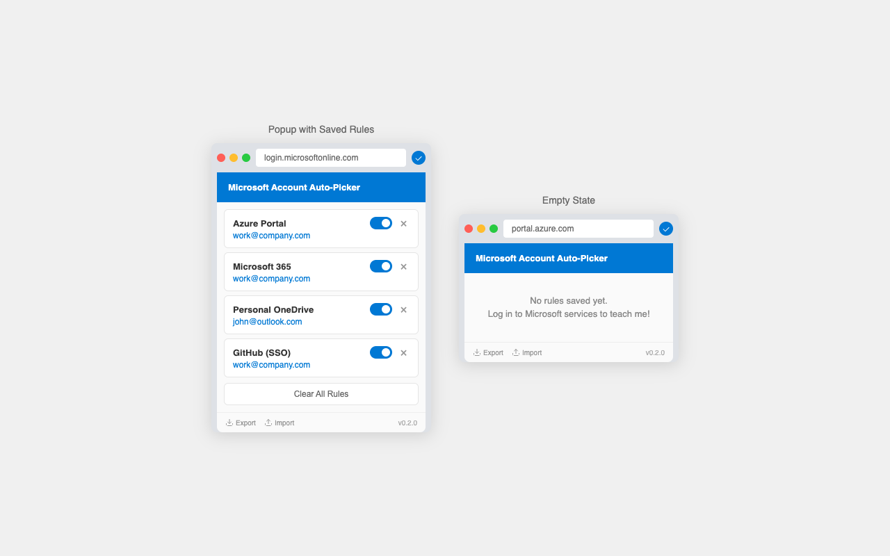

# Microsoft Account Auto-Picker

Browser extension (Chrome & Firefox) that remembers which Microsoft account you use for each service and auto-selects it next time.

## Install

The easiest way to install is via the official stores:

*   **Chrome**: [Chrome Web Store](https://chromewebstore.google.com/detail/microsoft-account-auto-pi/neaeoajchkdlbccamohnnjgkbpfagmia)
*   **Firefox**: [Firefox Add-ons](https://addons.mozilla.org/en-US/firefox/addon/microsoft-account-auto-picker/)

## How it works

When you pick an account on a Microsoft login page, the extension saves your choice for that service. Next time you visit, it clicks the right account for you.

Click the extension icon to see your saved rules. You can toggle them on/off or delete them.

### Import / Export

You can export your saved rules to a JSON file and import them on another machine or browser. This is useful for backing up your rules or syncing them between Work/Home computers.

## Supported flows

- OAuth2 / OpenID Connect
- SAML 2.0
- WS-Federation

## Privacy

Everything stays in your browser. No external servers, no tracking.

## License

MIT

---

## Manual Installation / Development

If you cannot use the stores or want to modify the code:

### 1. Get the code

*   **Option A (Stable):** Download and unzip the latest file from [Releases](../../releases).
*   **Option B (Dev):** Clone this repository.

### 2. Load into browser

**Chrome / Edge**
1.  Go to `chrome://extensions`.
2.  Enable "Developer mode" (top right).
3.  Click "Load unpacked" and select the extension folder.

**Firefox**
1.  Go to `about:debugging#/runtime/this-firefox`.
2.  Click "Load Temporary Add-on".
3.  Select the `manifest.json` file in the extension folder.
    > Note: Temporary add-ons are removed when Firefox closes.
